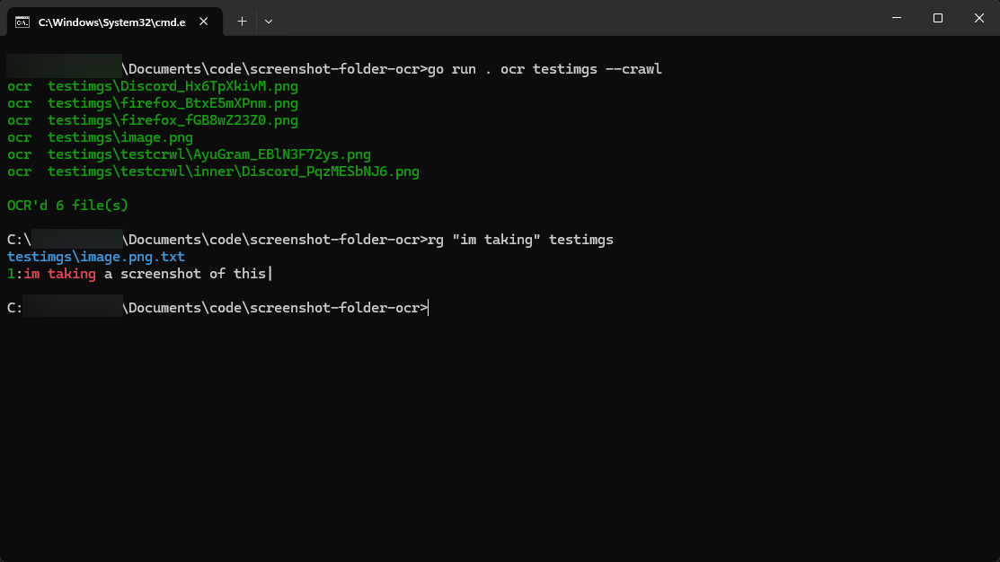

# screenshot-folder-ocr

CLI tool that runs OCR on images in a folder and saves the text next to each image as a `.txt` file (e.g. `photo.png` → `photo.png.txt`). Images that already have a matching txt are skipped.



## Installation

1. Install [Go](https://go.dev/dl/).
2. Install [Tesseract OCR](https://github.com/UB-Mannheim/tesseract/wiki) and make sure `tesseract` is on your `PATH`.
3. Clone this repo and build:

```bash
cd screenshot-folder-ocr
go build -o screenshot-folder-ocr .
```

## Usage

OCR images in a folder:

```bash
screenshot-folder-ocr ocr ./screenshots
```

OCR recursively through subfolders:

```bash
screenshot-folder-ocr ocr ./screenshots --crawl
```

Remove OCR txt files (only deletes `image.ext.txt` when `image.ext` exists):

```bash
screenshot-folder-ocr clean ./screenshots
screenshot-folder-ocr clean ./screenshots --crawl
```
